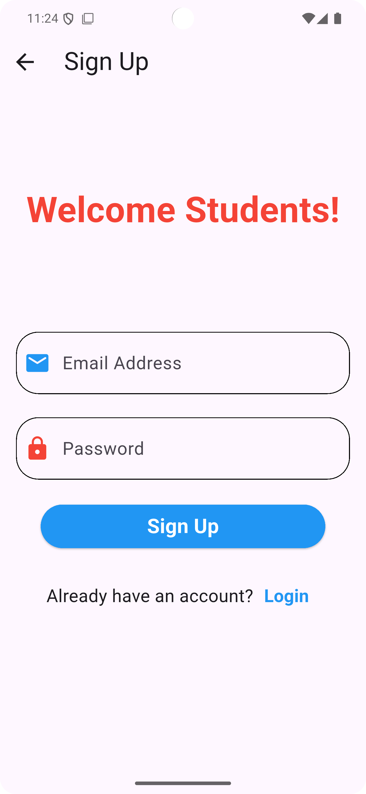
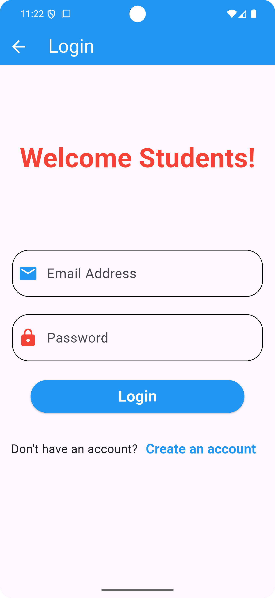
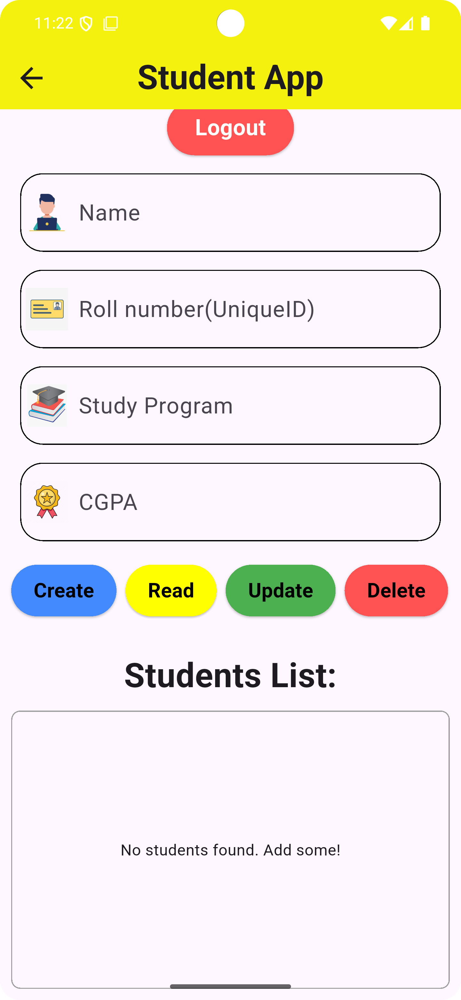

Students Record Management Flutter App

A Flutter application that provides user authentication (sign up & login) and student record management (CRUD operations) using Firebase Authentication and Cloud Firestore.

Features:
 
1. User Authentication:

* Sign up and login using email and password via Firebase Authentication.
* Error handling with snackbars for user feedback.
* Secure navigation between authentication and main app screens.

2. Student Records Management:

* CRUD(Create, Read, Update, Delete) operations for managing student records using Firestore.
* Each student record includes Name, Roll Number (unique), Program, and CGPA.
* Displays a dynamic list of all students with real-time updates.
* Input validation for all fields that non of the fields can be empty, including CGPA range checks.

3. User Interface:

* Responsive UI design.
* Snackbars for user feedback and error handling.
* Navigation between authentication and account management screens.
* Stateful widgets for authentication screens.
* Navigation TextButtons to navigate between signup and login screens in case user already exists or don't have an account respectively.

4. Sign Up:

* Register with email and password.
* Redirects to login on successful registration.
* Throws error in case user already exists or other errors.

5. Login:

* Authenticate existing users.
* Redirects to the main account page on success.
* Throws error in case user does not exist or other errors.

6. Account (Student Management):

* Add new student records.
* Read, update, or delete student records by roll number.
* Shows a table of all students.
* Logout functionality.

Screenshots:

App Walkthrough:
[Download demo video](assets/videos/v1.mp4)
